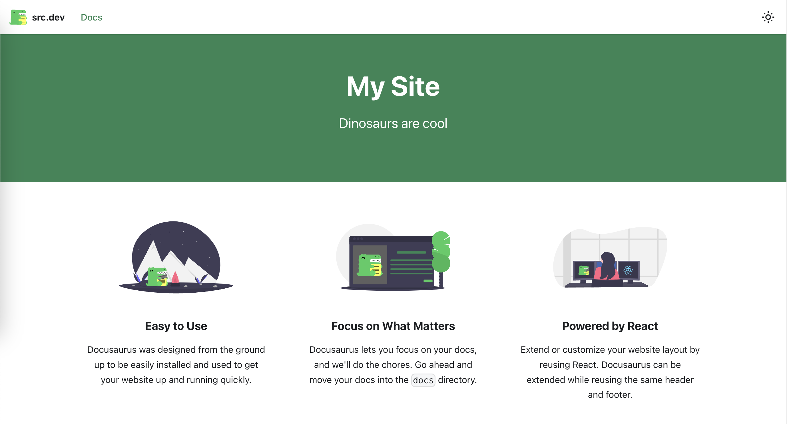

如何把 Docusaurus 設定成只有 Docs 的模式

因為目前只有紀錄學習筆記的需求，所以此篇主要紀錄如何把 Docusaurus 的介面簡化成只有 Docs 的模式。

本文使用的環境為 `macos`，而 Docusaurus 版本為 `3.0.1`。

必要條件：
* 了解 Docusaurus 官方 Getting Started 內容
  
執行步驟：
* 把 blog 的設定關閉
* 設定 docs 的 route base path 為 root
* 在預計要成為首頁的 doc 內加入 slug
* 移除原本的首頁

## 把 blog 的設定關閉

在 docusaurus.config.js 內，把 blog 關閉

```js
export default {
  // ...
  presets: [
    [
      '@docusaurus/preset-classic',
      {
        docs: {
          /* docs plugin options */
        },
        blog: false,
        // ...
      },
    ],
  ],
};
```

## 設定 docs 的 route base path 為 root

設定為 root 後，瀏覽器開啟網址的時候就會導向 docs

```js
export default {
  // ...
  presets: [
    [
      '@docusaurus/preset-classic',
      {
        docs: {
          routeBasePath: '/', // Serve the docs at the site's root
          /* other docs plugin options */
        },
        blog: false, // Optional: disable the blog plugin
        // ...
      },
    ],
  ],
};
```

## 在預計要成為首頁的 doc 內加入 slug

直接在文件 Front matter 區塊加入 `slug: /`

```js title="docs/intro.md"
---
slug: /
---
```

## 移除原本的首頁

原本的首頁長這個樣子



它的位置在 `./src/pages/index.js` ，把這個檔案移除就好了。

&nbsp;

之後首頁就會變成你設定的那一頁 doc 囉，完成！

參考：[Docs](https://docusaurus.io/docs/docs-introduction)