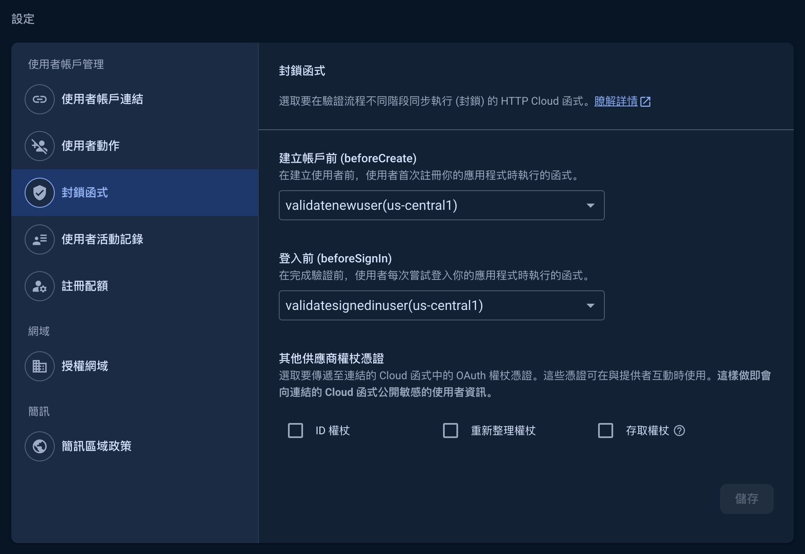

本篇紀錄 Authentication 如何設定白名單，以確保只有在白名單內的帳號才可以登入。

因為 Firebase Authentication 有跟 Google Cloud Identity Platform 做整合，因此可以利用 Identity Platform 的 “封鎖函式(Blocking Functions)” 來控制 User 的登入過程。

## 封鎖函式 Blocking Functions

在 Identity Platform 中，封鎖函式允許在用戶的認證生命週期中的特定時刻運行自定義邏輯。這些函數可以在用戶登錄、註冊、刪除賬戶等事件發生時觸發。

創建封鎖函式的流程：

1. 設置 Cloud Function： 首先，您需要在 Google Cloud Functions 中創建一個新函數。這個函數將包含您想要在用戶登入或註冊時執行的邏輯。

2. 定義封鎖行為： 在這個函數中，您可以定義特定的邏輯來決定是否允許用戶登入。例如，您可以檢查用戶是否被封禁、賬戶是否已驗證、或是否符合其他自定義條件。

3. 配置 Identity Platform： 在 Identity Platform 設置中，您將指定何時觸發這個函數。您可以選擇在登入前、註冊前等不同的身份驗證階段觸發。

## Cloud Function 白名單範例

此範例寫了兩個函數 `validatenewuser` `validatesignedinuser` 分別在 ***新用戶註冊前*** 以及 ***每次用戶登入前*** 執行，
執行內容為檢查該用戶的 email 是否在白名單內，若在白名單內則通過，否則回傳 `Unauthorized email`。

```python
from firebase_functions import identity_fn, https_fn
from firebase_admin import initialize_app

initialize_app()

whitelist = [
    "granted_user_01@google.com",
    "granted_user_02@google.com",
    "granted_user_03@google.com",
]


@identity_fn.before_user_created()
def validatenewuser(
    event: identity_fn.AuthBlockingEvent,
) -> identity_fn.BeforeCreateResponse | None:

    # User data passed in from the CloudEvent.
    user = event.data

    # Only users in the whitelist can sign up.
    if user.email is None or user.email not in whitelist:
        # Return None so that Firebase Auth rejects the account creation.
        raise https_fn.HttpsError(
            code=https_fn.FunctionsErrorCode.INVALID_ARGUMENT,
            message="Unauthorized email",
        )


@identity_fn.before_user_signed_in()
def validatesignedinuser(
    event: identity_fn.AuthBlockingEvent,
) -> identity_fn.BeforeSignInResponse | None:

    # User data passed in from the CloudEvent.
    user = event.data

    # Only users in the whitelist can sign in.
    if user.email is None or user.email not in whitelist:
        # Return None so that Firebase Auth rejects the account creation.
        raise https_fn.HttpsError(
            code=https_fn.FunctionsErrorCode.INVALID_ARGUMENT,
            message="Unauthorized email",
        )

```

部署至 Cloud Functions 後，再到 Firebase Authentication 的 Settings 頁面，選擇正確的封鎖函式，就可以達成白名單的效果。



## 白名單資料擺放位置

實務上因為白名單有可能會變動，此時就不建議把白名單寫死在 Cloud Function 內部，因為每一次的修改都要重新部署。

可考慮將白名單放在其他地方（例如 Firestore Database），然後在執行 Cloud Function 時去讀取外部的白名單資料，這樣在修改白名單時就不用重新部署了。

可以依照專案的情況自行評估該如何配置。