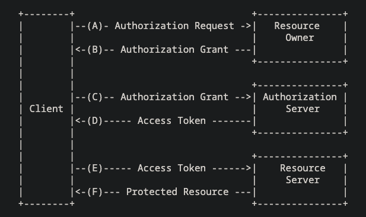
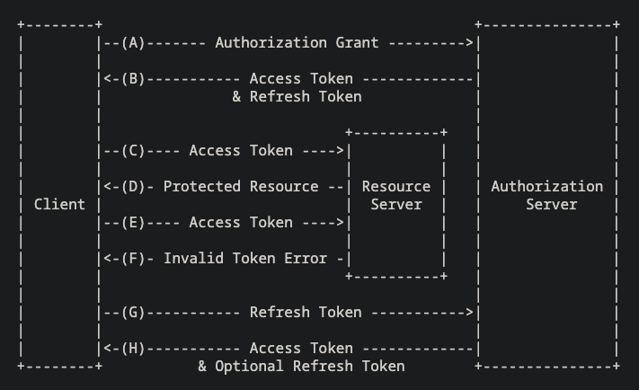

OAuth 2.0 授權架構賦予第三方應用程式在特定條件下，訪問 HTTP 服務的能力。這種授權既可以是代表資源所有者，透過協調其與 HTTP 服務之間的同意過程來獲得，也可以是讓第三方應用程式直接為自身獲得訪問權限。

## 介紹

在傳統的客戶端-伺服器認證模式中，客戶端需要用資源擁有者（例如用戶）的認證資料向伺服器驗證身份，以此來請求存取伺服器上的限制性資源（即受保護的資源）。為了讓第三方應用程序能夠存取這些受限資源，資源擁有者會將自己的登入資訊共享給第三方。這種做法引發了多個問題和限制：

* 第三方應用必須儲存資源擁有者的登入資訊，以便日後使用，這通常意味著以明文方式保存密碼。
* 伺服器必須支援密碼認證方式，儘管這樣做存在密碼固有的安全隱患。
* 第三方應用獲得了過於廣泛的存取權限，可以接觸到資源擁有者的各種受保護資源，而資源擁有者卻無法對這些存取行為進行時間或範圍上的限制。
* 資源擁有者若想撤回某個第三方的存取權，往往需要改變密碼，這也同時影響到所有其他第三方的存取。
* 一旦任何第三方應用遭到攻擊，將會危及終端用戶的密碼安全，以及所有由該密碼保護的數據。

OAuth 通過引入授權層解決了這些問題，並將客戶端的角色與資源擁有者的角色區分開來。在 OAuth 模式下，客戶端請求存取資源擁有者控制的資源，這些資源由資源伺服器提供。而客戶端所獲得的認證與資源擁有者的不同。

客戶端不再使用資源擁有者的登入資訊來存取受保護的資源，而是獲得一個 ***存取權杖***。這個權杖是一串特定的字串，標記了 ***存取的範圍***、***有效期限*** 及其他 ***相關屬性***。這些存取權杖由授權伺服器發放給第三方客戶端，並得到資源擁有者的同意。客戶端使用這個權杖來存取資源伺服器上的受保護資源。

舉例來說，一位終端用戶（資源擁有人）可以授權給一家印刷廠（客戶端），讓其存取她儲存在相片分享服務（資源伺服器）的相片，而無需向印刷廠透露她的用戶名和密碼。相反，她會直接與相片分享服務信任的伺服器（授權伺服器）進行驗證，該伺服器則會發給印刷廠專門的存取權杖。

### 角色

OAuth 涉及四大核心角色：

#### 資源擁有者 Resource Owner
指可以允許他人存取受保護資源的個體。如果資源擁有者是個人，則稱作終端用戶 (end-user)。

#### 資源伺服器 Resource Server
存放受保護資源的伺服器，它能夠處理並回應那些附帶有存取權杖的資源請求。

#### 客戶端 Client
一種代表資源擁有者並取得其授權來請求受保護資源的應用程序。這裡所說的「客戶端」並不限定於特定的運作方式，如應用程序可能運行在伺服器、個人電腦或其他設備上。

#### 授權伺服器 Authorization Server
這是一種在驗證了資源擁有者身份並取得其授權後，會向客戶端發放存取權杖的伺服器。

需要特別指出的是，授權伺服器與資源伺服器之間的相互作用並不包括在此規範範圍內。授權伺服器可能與資源伺服器為同一伺服器，也可能是兩個不同的實體。單一的授權伺服器有可能發行多個資源伺服器都接受的存取權杖。

### 流程

OAuth 2.0 的基本流程描述了四種角色之間的相互作用，涵蓋以下幾個步驟：

> (A) 客戶端向資源所有者申請授權。這種授權請求可以直接向資源所有者提出，或更理想地，透過授權伺服器間接進行。

> (B) 客戶端獲得授權准證，這是一種代表資源所有者授權的證明，可以採用本標準中定義的四種授權方式之一，或者是採用其他擴充的授權方式。選擇哪種授權方式取決於客戶端的請求方式及授權伺服器所支援的方式。

> (C) 客戶端透過向授權伺服器驗證自己的身份，並出示授權准證來申請取得訪問令牌。

> (D) 授權伺服器對客戶端進行身份驗證，檢查授權准證是否有效，如有效則發放訪問令牌。

> (E) 客戶端向資源伺服器請求受保護的資源，並提供訪問令牌以證明自己的身份。

> (F) 資源伺服器檢驗訪問令牌的有效性，一旦驗證通過，便會提供所請求的服務。

### 授權准證 Authorization Grant

授權准證是一種代表資源擁有者授權的憑證，主要用途是幫助客戶端獲取訪問令牌，以便訪問受保護的資源。這項規範中定義了四大類型的授權方式：授權碼、隱式授權、資源擁有者的密碼憑證以及客戶端憑證。除此之外，還提供了一種可擴展機制，用於定義其他類型的授權方式。

#### 授權碼 Authorization Code

授權碼是通過授權伺服器，作為客戶端和資源擁有者之間的中介來獲取的。與其直接向資源擁有者請求授權，客戶端會引導資源擁有者透過其網絡瀏覽器（依照 [RFC2616] 的定義）前往授權伺服器，然後該伺服器會帶著授權碼將資源擁有者重新導向回客戶端。

在把資源擁有者和授權碼一起引導回客戶端之前，授權伺服器會先進行資源擁有者的身份驗證並確認其授權。由於資源擁有者只在授權伺服器進行身份驗證，他們的憑證就不會被分享給客戶端。

授權碼提供了若干重要的安全優勢，包括能夠驗證客戶端的身份，以及將訪問令牌直接傳送給客戶端，而不需要經過資源擁有者的瀏覽器，這樣可以防止令牌被包括資源擁有者本人在內的其他人接觸到。

#### 隱式授權 Implicit

隱式授權是一種針對在瀏覽器中使用腳本語言（如 JavaScript）實現的客戶端所優化的簡化授權碼流程。在這種流程中，客戶端不是獲得一個授權碼，而是直接獲得一個訪問令牌，這是資源擁有者授權的直接結果。這種授權類型稱為隱式，因為過程中不會發出任何中間憑證（比如授權碼），而這些憑證通常會用來獲取訪問令牌。

在隱式授權流程中，當發放訪問令牌時，授權伺服器並不驗證客戶端的身份。在一些情況下，可以透過重定向 URI 來確認客戶端的身份，這個 URI 用於將訪問令牌傳遞給客戶端。這個訪問令牌可能會暴露給資源擁有者或其他能接觸到資源擁有者瀏覽器的應用程式。

雖然隱式授權可以提高某些客戶端（如瀏覽器內應用程式）的反應速度和效率，因為它減少了獲得訪問令牌所需要的往返次數，但使用隱式授權的便利性需要與其可能帶來的安全風險進行權衡，特別是當存在授權碼授權方式的情況下。

#### 資源擁有者的密碼憑證 Password Credentials

資源擁有者的用戶名和密碼（即密碼認證）可以直接用作授權憑證，以換取訪問令牌。這種做法應當只在資源擁有者和客戶端之間有高度的信任關係時採用，如客戶端是裝置操作系統的一部分或是一個高權限應用程式，並且在其他授權憑證類型（例如授權碼）不可用的情況下使用。

雖然這種授權方式需要客戶端直接使用資源擁有者的認證，但這些認證僅用於一次請求，之後會被換成訪問令牌。這種方式可以避免客戶端將來需要儲存資源擁有者的認證，因為可以將這些認證換成一個長效的訪問令牌或刷新令牌。

#### 客戶端憑證 Client Credentials

當授權範圍僅限於客戶端所控制的受保護資源，或是與授權服務器事前協商的受保護資源時，客戶端憑證（或其他形式的客戶端認證）可被用作授權憑證。在客戶端代表自己（即客戶端同時也是資源擁有者）或是基於與授權伺服器先前達成的授權協議來請求存取受保護資源的情況下，客戶端憑證通常會被用作授權憑證。

### Access Token

Access Token 是一種憑證，用於存取受保護的資源。它是一串代表對客戶端授權的字串，對客戶端而言，這串字串通常是不透明的。Token 指定了特定的存取範圍和期限，這些由資源擁有者授予，並由資源和授權伺服器執行。

Token 可能是一個識別碼，用於取回授權資訊，或者可能直接包含了可以驗證的授權資訊（如含有數據和簽名的 Token 字串）。客戶端使用 Token 時，可能需要額外的認證憑證，但這超出了本規範的範疇。

Access Token 提供了一個抽象層，用單一 Token 替代了不同的授權方式（如用戶名和密碼），讓資源伺服器可以理解。這種抽象使得發行的 Access Token 可以比獲取它們的授權憑證有更嚴格的限制，同時減少了資源伺服器需要理解多種認證方法的負擔。

Access Token 的格式、結構和使用方式可能會根據資源伺服器的安全需求有所不同，例如其加密特性。關於 Access Token 的屬性和存取受保護資源的方法，不在本規範範圍內，而是由相關的規範（如 [RFC6750]）所定義。

### Refresh Token

Refresh Token 是用來獲取新的 Access Token 的憑證。它們在當前 Access Token 失效或過期，或當需要獲得範圍相同或更小的額外 Access Token 時由授權伺服器發給客戶端（注意，Access Token 的有效期和權限可能比資源擁有者所授權的範圍要小）。發放 Refresh Token 是授權伺服器的自由裁量權，不是必須的。如果授權伺服器確實發放了 Refresh Token，那麼它會在發放 Access Token 的時候一起提供。

Refresh Token 是一種代表資源擁有者給予客戶端授權的字串，對客戶端來說通常是不透明的。這個 Token 是一個標識碼，用於獲取授權資訊。與 Access Token 不同，Refresh Token 只用於與授權伺服器之間的交互，不會被發送給資源伺服器。

上圖描述的流程涵蓋以下步驟：

> (A) 客戶端通過向授權伺服器證明自己的身份並提出授權請求，來請求獲得 Access Token。

> (B) 授權伺服器對客戶端進行身份驗證，確認授權請求的有效性，如果授權請求有效，則會發放 Access Token 和 Refresh Token。

> (C) 客戶端展示 Access Token，向資源伺服器發起對受保護資源的請求。

> (D) 資源伺服器檢驗 Access Token，若該 Token 有效，則響應請求。

> (E) 直到 Access Token 過期之前，步驟 (C) 和 (D) 會不斷重複。若客戶端察覺到 Access Token 已過期，則直接進行步驟 (G)；否則，它會再次發起對受保護資源的請求。

> (F) 由於 Access Token 無效，資源伺服器會回傳一個 Token 無效的錯誤。

> (G) 客戶端通過證明自己的身份給授權伺服器，並展示 Refresh Token，來請求一個新的 Access Token。客戶端的身份驗證要求取決於其類型以及授權伺服器的政策。

> (H) 授權伺服器驗證客戶端身份並檢查 Refresh Token 的有效性，若有效，則發放一個新的 Access Token（以及可選的新的 Refresh Token）。

參考：[The OAuth 2.0 Authorization Framework](https://datatracker.ietf.org/doc/html/rfc6749)